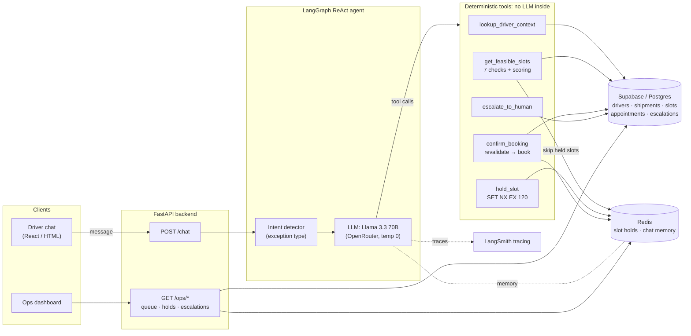
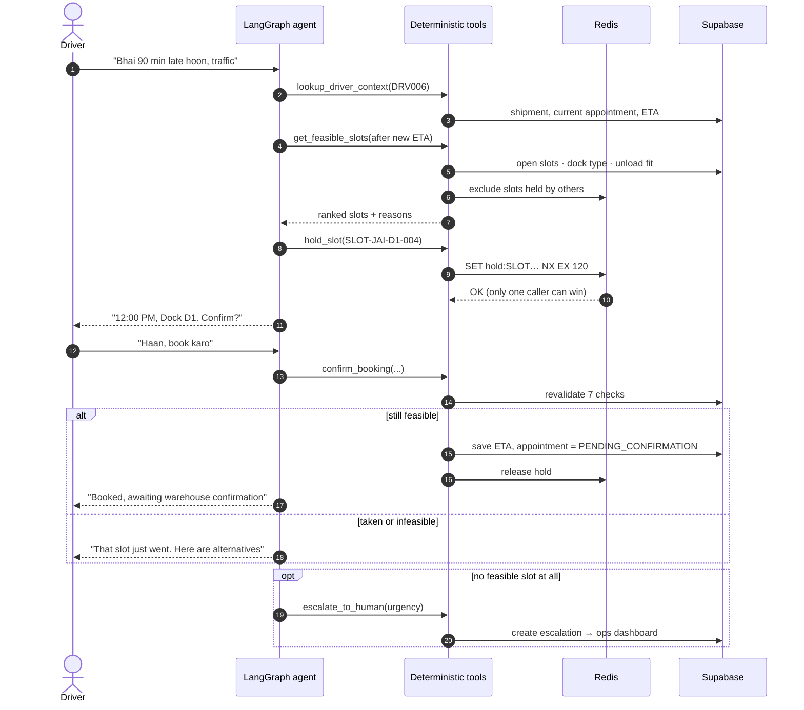
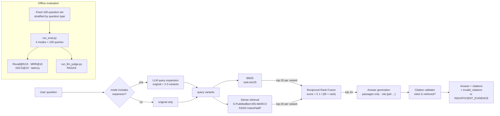

```mermaid
flowchart LR
    subgraph Clients
        D["Driver chat<br/>(React / HTML)"]
        O["Ops dashboard"]
    end

    subgraph API["FastAPI backend"]
        C["POST /chat"]
        Q["GET /ops/*<br/>queue · holds · escalations"]
    end

    subgraph Agent["LangGraph ReAct agent"]
        L["LLM: Llama 3.3 70B<br/>(OpenRouter, temp 0)"]
        I["Intent detector<br/>(exception type)"]
    end

    subgraph Tools["Deterministic tools: no LLM inside"]
        T1["lookup_driver_context"]
        T2["get_feasible_slots<br/>7 checks + scoring"]
        T3["hold_slot<br/>SET NX EX 120"]
        T4["confirm_booking<br/>revalidate → book"]
        T5["escalate_to_human"]
    end

    R[("Redis<br/>slot holds · chat memory")]
    S[("Supabase / Postgres<br/>drivers · shipments · slots<br/>appointments · escalations")]
    LS["LangSmith tracing"]

    D -->|message| C --> I --> L
    L -->|tool calls| Tools
    T1 & T2 & T4 & T5 --> S
    T2 -->|skip held slots| R
    T3 & T4 --> R
    L -. memory .- R
    L -. traces .-> LS
    O --> Q --> S
    Q --> R
```

```mermaid
sequenceDiagram
    autonumber
    actor Driver
    participant Agent as LangGraph agent
    participant Tools as Deterministic tools
    participant Redis
    participant DB as Supabase

    Driver->>Agent: "Bhai 90 min late hoon, traffic"
    Agent->>Tools: lookup_driver_context(DRV006)
    Tools->>DB: shipment, current appointment, ETA
    Agent->>Tools: get_feasible_slots(after new ETA)
    Tools->>DB: open slots · dock type · unload fit
    Tools->>Redis: exclude slots held by others
    Tools-->>Agent: ranked slots + reasons
    Agent->>Tools: hold_slot(SLOT-JAI-D1-004)
    Tools->>Redis: SET hold:SLOT… NX EX 120
    Redis-->>Tools: OK (only one caller can win)
    Agent-->>Driver: "12:00 PM, Dock D1. Confirm?"
    Driver->>Agent: "Haan, book karo"
    Agent->>Tools: confirm_booking(...)
    Tools->>DB: revalidate 7 checks
    alt still feasible
        Tools->>DB: save ETA, appointment = PENDING_CONFIRMATION
        Tools->>Redis: release hold
        Agent-->>Driver: "Booked, awaiting warehouse confirmation"
    else taken or infeasible
        Agent-->>Driver: "That slot just went. Here are alternatives"
    end
    opt no feasible slot at all
        Agent->>Tools: escalate_to_human(urgency)
        Tools->>DB: create escalation → ops dashboard
    end
```

```mermaid
flowchart LR
    Q["User question"] --> X{"mode includes<br/>expansion?"}
    X -- yes --> E["LLM query expansion<br/>original + 2-3 variants"]
    X -- no --> V["original only"]
    E --> V2["query variants"]
    V --> V2

    V2 --> B["BM25<br/>rank-bm25"]
    V2 --> DN["Dense retrieval<br/>S-PubMedBert-MS-MARCO<br/>FAISS IndexFlatIP"]

    B -- top 20 per variant --> F["Reciprocal Rank Fusion<br/>score = Σ 1 / (60 + rank)"]
    DN -- top 20 per variant --> F
    F -- top 10 --> G["Answer generation<br/>passages only · cite [pid:…]"]
    G --> CV["Citation validator<br/>cited ⊆ retrieved?"]
    CV --> A["Answer + citations<br/>+ invalid_citations<br/>or INSUFFICIENT_EVIDENCE"]

    subgraph Offline["Offline evaluation"]
        QS["Fixed 100-question set<br/>stratified by question type"] --> H["run_eval.py<br/>4 modes × 100 queries"]
        H --> M["Recall@5/10 · MRR@10<br/>nDCG@10 · latency"]
        H --> J["run_llm_judge.py<br/>RAGAS"]
    end
```
